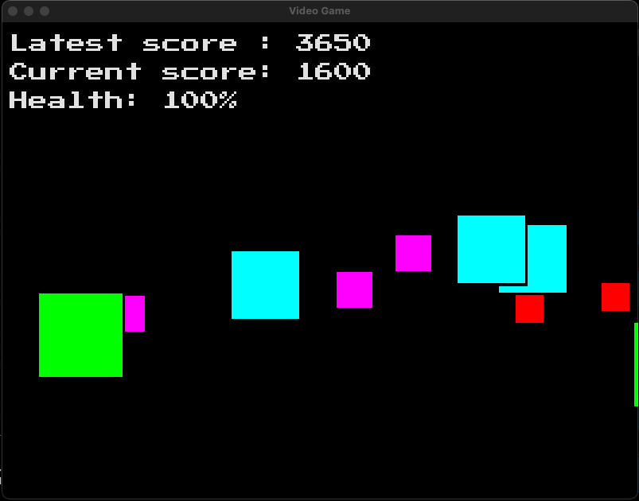
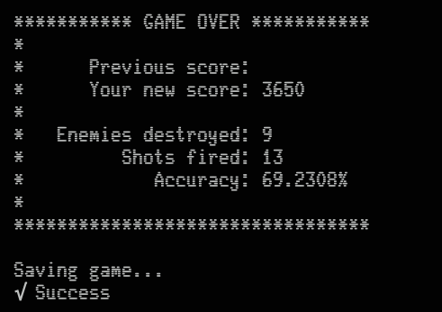
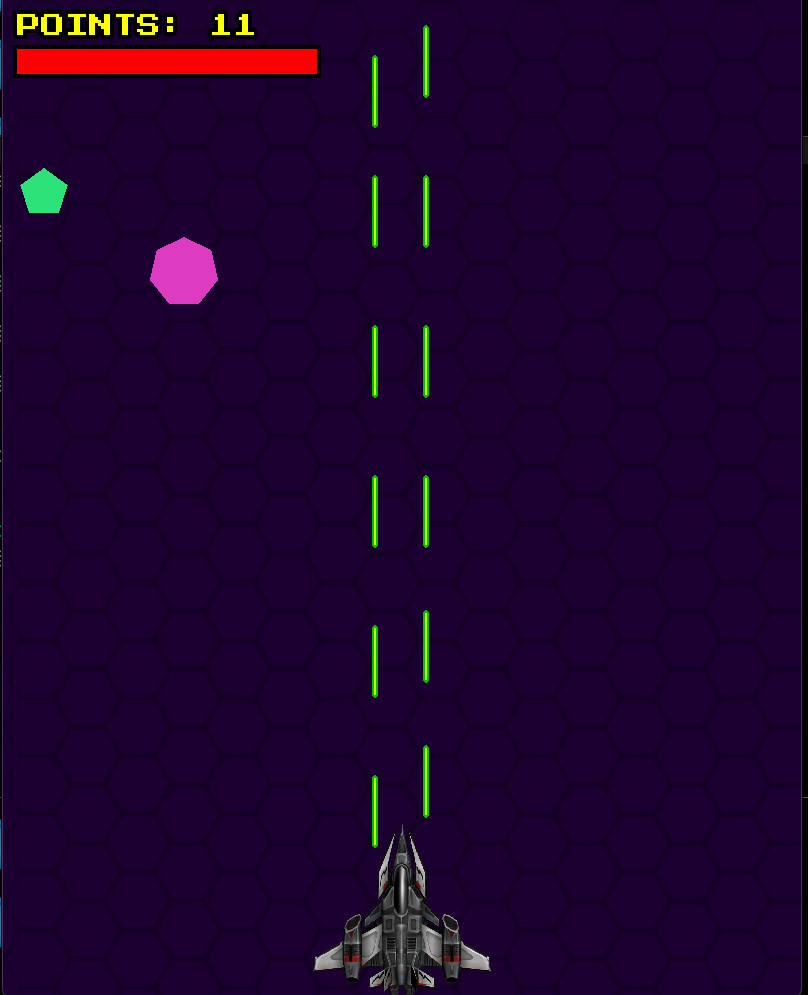
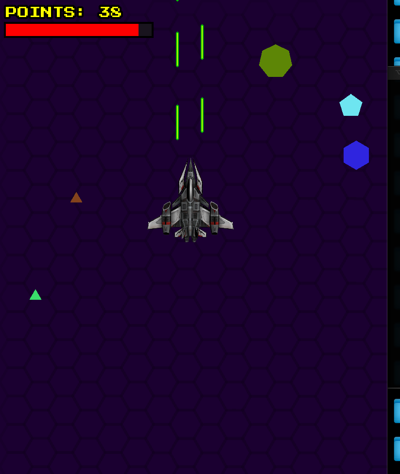
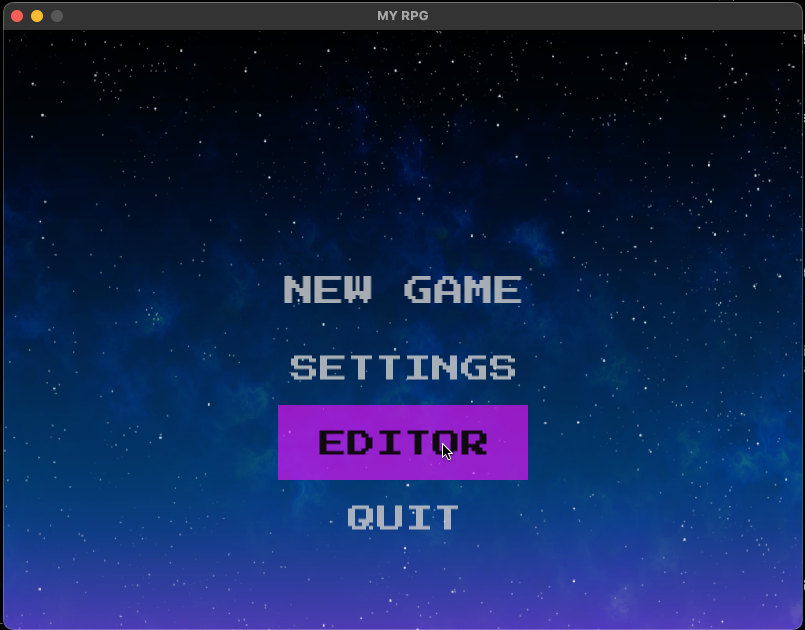
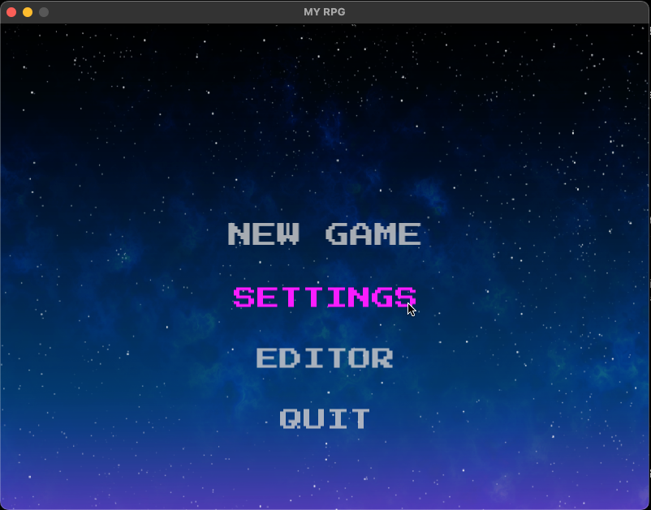
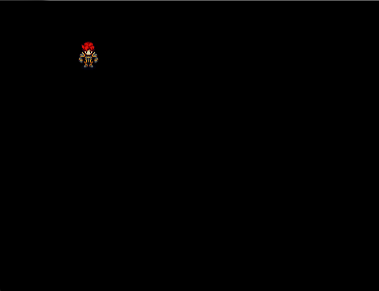

## SFML Games

### Reference

[SFML Docs](https://www.sfml-dev.org/documentation/2.5.1/annotated.php)

[CPP Reference](https://en.cppreference.com/w/)

### 1. Brick Hero

#### Instructions

##### Navigate to the main directory
`cd SFML_TUTORIAL`

##### Compile
`g++ -g ./BrickHero/main.cpp ./BrickHero/Game.cpp -o ./BrickHero/prog -lsfml-graphics -lsfml-window -lsfml-system -lsfml-audio -lsfml-network`

##### Run
`./BrickHero/prog`

#### Screenshots

##### Gameplay

##### Game over

---

### 2. Space Blaster

#### Instructions

##### Navigate to the main directory
`cd SFML_TUTORIAL`

##### Compile
`g++ -g ./SpaceBlaster/main.cpp ./SpaceBlaster/Bullet.cpp ./SpaceBlaster/Enemy.cpp ./SpaceBlaster/Player.cpp ./SpaceBlaster/Game.cpp -o ./SpaceBlaster/prog -lsfml-graphics -lsfml-window -lsfml-system -lsfml-audio -lsfml-network`

##### Run
`./SpaceBlaster/prog`

#### Screenshots

##### Gameplay

##### Game over

---

### 3. Open World RPG (IN DEVELOPMENT)

#### Instructions

##### Navigate to the main directory
`cd SFML_TUTORIAL`

##### Compile
`g++ -g ./OpenWorldRPG/main.cpp ./OpenWorldRPG/Game.cpp ./OpenWorldRPG/Entity.cpp ./OpenWorldRPG/GameState.cpp ./OpenWorldRPG/State.cpp ./OpenWorldRPG/MainMenuState.cpp ./OpenWorldRPG/Button.cpp ./OpenWorldRPG/Player.cpp ./OpenWorldRPG/MovementComponent.cpp ./OpenWorldRPG/AnimationComponent.cpp -o ./OpenWorldRPG/prog -lsfml-graphics -lsfml-window -lsfml-system -lsfml-audio -lsfml-network`

##### Run
`./OpenWorldRPG/prog`

#### Screenshots

##### Menu

##### Game

